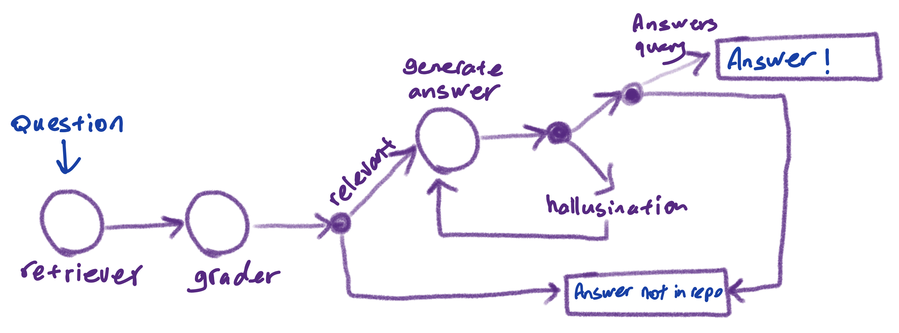

# GitHub_RAG
This repo is a RAG model to answer question from GitHub repos.

## Preview

For a quick preview, see the image below:



## Requirements

This project requires Python 3.7 or later. All necessary dependencies are listed in the `requirements.txt` file. You can install them using pip:
```
pip install -r requirements.txt
```

## How to Run

1. Clone this repository:
```
git clone https://github.com/msargordi/GitHub_RAG.git
cd GitHub_RAG
```

3. Run the script with Python:
```
python main.py [arguments]
```

The script accepts several optional arguments:
```
- `--file_types`: List of file extensions to process. Default is `.py .md .ipynb .sh`.
- `--chunk_size`: Chunk size for text splitting. Default is 250.
- `--num_docs`: Number of best retrieved documents. Default is 4.
- `--model_name`: Name of the LLM model to use. Default is "codellama:7b".
```
Example:
```
python main.py --file_types .py .md --chunk_size 300 --num_docs 5 --model_name "codellama:13b"
```
